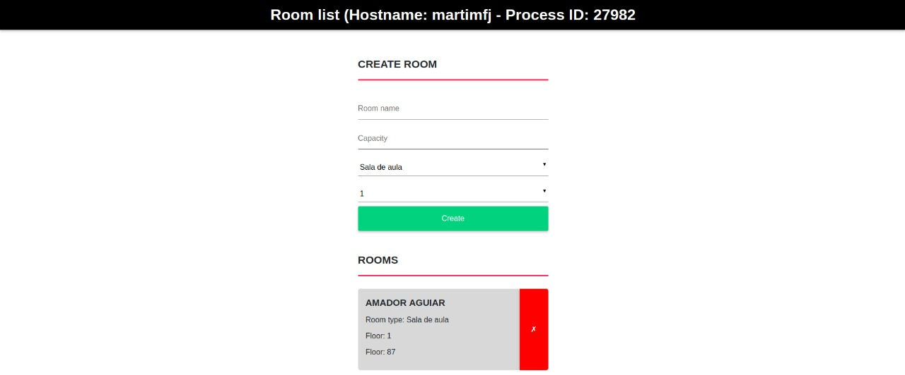

# R2: Reserve a Room - Application

Este é o projeto final da disciplina Computação em Nuvem (2018.2) do curso de Engenharia da Computação do Insper. Ainda é uma aplicação em construção, mas para o projeto da matéria, só foi feito uma REST API, em que é possível ver todas as salas, ver uma sala específica, adicionar uma sala, atualizar os dados de uma sala e deletar. Há também uma rota que responde se o servidor da aplicação ainda está rodando. Essas rotas estão documentadas [aqui](https://documenter.getpostman.com/view/5903781/RzZDgwRN).

Interface:




## Instalação
Primeiro é preciso [instalar o MongoDB](https://docs.mongodb.com/manual/installation/). E depois instalar as dependências do Python rodando o seguinte comando (dentro da pasta):


```
$ sudo pip install -r requirements.txt
```

Isso instalará o Flask e o PyMongo

## Uso
Para utilizar o programa é preciso ter certeza de que o serviço do MongoDB está rodando:


```
$ sudo service mongod start
```

E depois iniciar a aplicação:

```
$ python application.py
```

Assim, é possível acessar `localhost:5000`, podendo criar e visualizar as salas.

## Melhorias
* Implementar UPDATE e DELETE na interface com o usuário
* Implementar um filtro das salas

